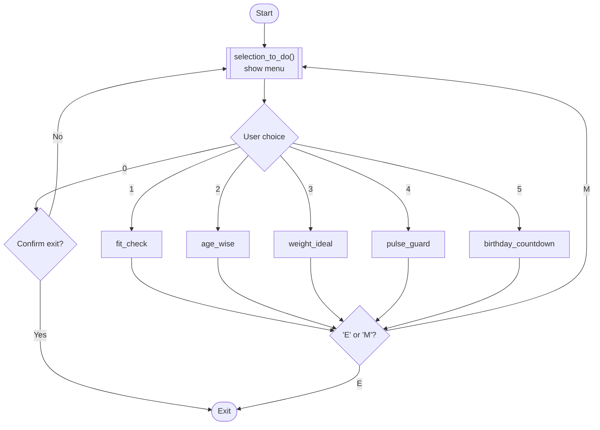

<div align="center">

# 🩺💗 HEALTH MATE

### *Your pocket-sized wellness sidekick — right in the terminal.*


*A single-file, zero-dependency Python health toolkit — BMI, age, ideal weight, blood pressure & birthday countdown, all from one friendly menu.*

</div>

<br>

## ✨ Overview

**Health Mate** is a lightweight, object-oriented command-line application built entirely with Python's standard library. No `pip install`, no config files — just clone it and run it. It wraps five bite-sized health calculators inside one clean, loop-driven menu (`HealthToolKit`), making it a great example of:

- 🧱 clean **class-based** CLI design
- 🔁 robust **input-validation loops** (`while/try/except`)
- 🧮 real-world **health formulas** implemented from scratch
- 🗓️ **date arithmetic** with Python's `datetime` module

<br>

## 🧭 Table of Contents

- [Features](#-features)
- [Live Screenshots](#️-live-screenshots)
- [Getting Started](#-getting-started)
- [Code Structure](#-code-structure)
- [License](#-license)

<br>

## 🚀 Features

| # | Module | What it does |
|---|--------|---------------|
| 1️⃣ | **Fit-Check** | Calculates BMI from height & weight, then classifies you as Underweight / Healthy / Overweight / Obese |
| 2️⃣ | **Check-Age** | Instantly works out your current age from your birth year |
| 3️⃣ | **Ideal-Weight** | Estimates ideal body weight (Devine formula, gender-aware) |
| 4️⃣ | **Pulse-Guard** | Categorizes blood pressure (Normal → Elevated → Stage 1 → Stage 2 → Hypertensive Crisis) |
| 5️⃣ | **Birthday Countdown** | Counts down the days until your next birthday 🎉 |

Every module runs inside a **safe input loop** — mistype something and Health Mate just asks again, no crashes (mostly 👀 — see [Known Issues](#-known-issues--found-while-testing)).

<br>

## 🖥️ Live Screenshots

> These aren't mockups — every screenshot below is a real, captured run of `health_mate.py`.

<div align="center">

#### 🏠 Main Dashboard


#### 1️⃣ Fit-Check — BMI Calculator


#### 2️⃣ Check-Age


#### 3️⃣ Ideal-Weight Estimator


#### 4️⃣ Pulse-Guard — Blood Pressure Check


#### 5️⃣ Birthday Countdown 🎂


</div>

<br>

## ⚙️ How It Works



> 💡 Tip: GitHub renders the diagram above natively. If your viewer doesn't support Mermaid, it just falls back to a readable code block — no harm done.

<br>

## 🏁 Getting Started

**Requirements:** Python 3.10+ (standard library only — nothing else to install!)

```bash
# 1. Clone or download the file
git clone https://github.com/your-username/health-mate.git
cd health-mate

# 2. Run it
python3 health_mate.py
```

Then just follow the on-screen menu — press a number, answer the prompts, and press **`M`** to go back to the dashboard or **`E`** to exit.

<br>

## 🧩 Code Structure

```text
health_mate.py
└── class HealthToolKit
    ├── fit_check()          → BMI calculator + category
    ├── age_wise()            → age from birth year
    ├── weight_ideal()        → Devine formula ideal weight
    ├── pulse_guard()         → blood pressure category
    ├── birthday_countdown()  → days until next birthday
    └── selection_to_do()     → main menu / router loop
```

Each method follows the same friendly pattern:

```python
while True:
    try:
        value = float(input("Enter your ..."))
        break
    except:
        print("Invalid Input. Try Again!")
```

...so the app never dies on a bad `input()` — it just re-prompts. 🙌

<br>


## 📜 License

Released under the **MIT License** — free to use, modify, and share.

<br>

<div align="center">

**Made in 🐍 Python with love <3 **

*If Health Mate helped you, consider giving the repo a ⭐*

</div>
